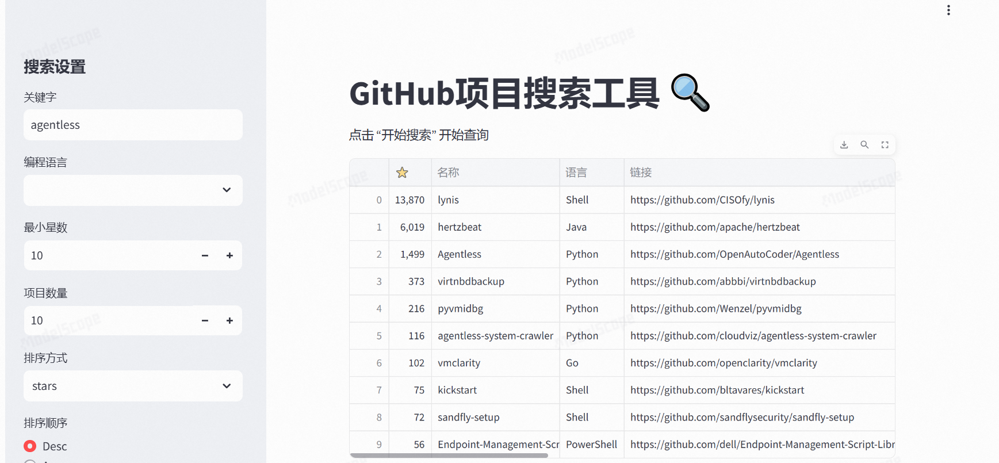
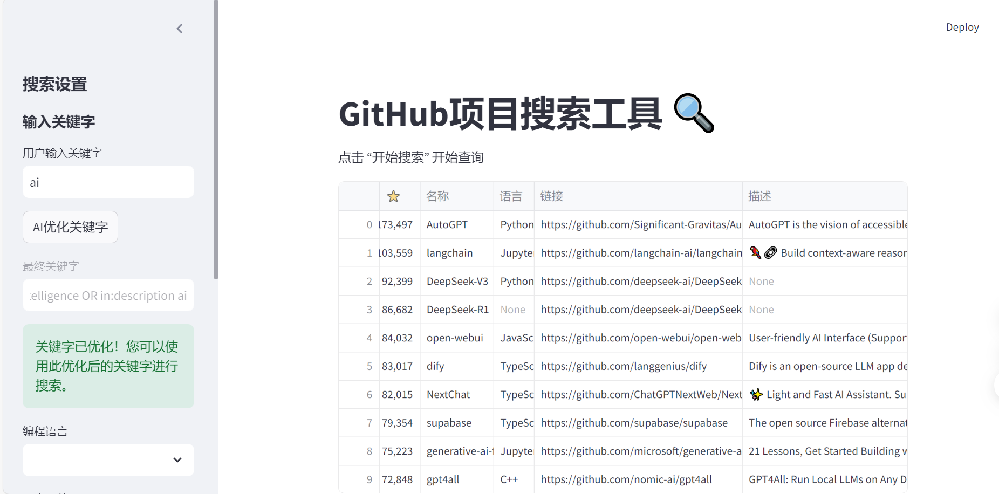

# GitHub项目搜索工具 🔍

[]()
[]()
[]()

基于Streamlit构建的GitHub仓库智能搜索工具，支持多条件筛选和实时结果展示

## 功能特性

- 🎛️ 交互式搜索面板配置搜索参数
- 🔍 多维度过滤（编程语言、星标数量、排序方式）
- 📊 实时表格展示搜索结果
- ⚡ 基于GitHub REST API的快速查询
- 📱 响应式网页设计适配多端设备

## 安装指南

### 前置要求
- Python 3.8+
- GitHub个人访问令牌（可选，用于提高API限额）

### 安装步骤
```bash
git clone https://github.com/jinhongzou/github-search.git
cd github-search
pip install -r requirements.txt
```
## 使用说明
### 首次运行
```python
streamlit run app.py
```
-   **用户关键字搜索：**


-    **AI优化搜索**（非必须，需配置llm信息）：


### 界面功能说明
在侧边栏配置搜索参数：
-    关键字：项目名称/描述关键词
-    编程语言：过滤指定语言项目
-    最小星数：筛选优质项目
-    排序方式：按星标/分叉/更新时间排序
-    点击"开始搜索"按钮启动查询
-	** AI 辅助分析**:（开发中）
结果将以交互表格形式展示在主页

### 项目结构
├── app.py                 # 主程序入口
├── requirements.txt       # 依赖库列表
└── utilities/
    └── githubsearch.py    # GitHub API封装模块
### 技术栈
Streamlit (Web框架)
Pandas (数据处理)
GitHub REST API v3

### 授权许可
[MIT License](https://img.shields.io/badge/license-MIT-green)


注意事项：
1. 请确保补充创建`requirements.txt`文件，内容应包含：
```text
streamlit>=1.29.0
pandas>=2.0.0
requests>=2.31.0
```
